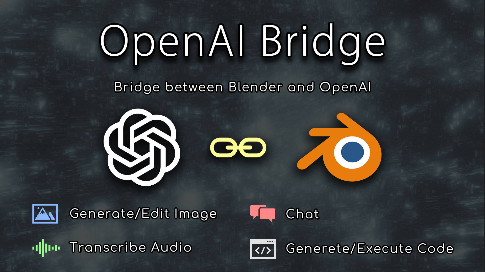

# Blender Add-on: OpenAI Bridge

This is a Blender add-on **OpenAI Bridge** to use the OpenAI API on Blender seamlessly.

## Download / Installation

All released OpenAI-Bridge add-on is available on
[Release Page](https://github.com/nutti/OpenAI-Bridge/releases).  
If you want to try newest (unstable) version, you can download it from
[unstable version](https://github.com/nutti/OpenAI-Bridge/archive/refs/heads/main.zip).

Installation process is a bit confusing.  
See [Document](docs/installation.md) if you have any trouble to install this
add-on.

## Features

The features of this add-on are as follows.

* Image Tool
  * Generate Images: Generate images using the OpenAI Image API.
  * Edit Images: Edit images using the OpenAI Image API.
  * Generate Variation Images: Generate variation images using the OpenAI
    Image API.
  * Supported Models: 'DALL-E'
* Audio Tool
  * Transcribe Audio: Transcribe audio using the OpenAI Audio API.
  * Supported Models: 'whisper-1'
* Chat Tool
  * Chat: Chat using the OpenAI Chat API.
  * Ask Blender Operators/Properties: Ask Blender operators/properties from the
    right-click menu.
  * Supported Models: 'gpt-3.5-turbo', 'gpt-4', 'gpt-4-32k'
* Code Tool
  * Generate Code: Generate Blender Python specific code using the OpenAI Chat API.
  * Edit Code: Edit Blender Python specific code using the OpenAI Chat API.
  * Generate Code Examples: Generate code examples using Python API
    from the right-click menu.
  * Execute Code Immediately: Execute the generated code immediately. This
    allows us to control Blender from the prompt or audio input.
  * Supported Models: 'gpt-3.5-turbo', 'gpt-4', 'gpt-4-32k'

## Tutorials

See [Document](docs/tutorial.md) to know the details of this add-on.

## Change Log

See [CHANGELOG.md](CHANGELOG.md)

## Bug report / Feature request / Disscussions

If you want to report bug, request features or discuss about this add-on, see
[ISSUES.md](ISSUES.md).

## Contribution / Support

If you want to contribute to or support this project, see
[CONTRIBUTING.md](CONTRIBUTING.md).

## Project Authors

### Owner

[**@nutti**](https://github.com/nutti)

Indie game/application Developer.  
In particular, I spend most time to improve Blender and Unreal Game Engine by
providing the extensions.

Support via [GitHub Sponsors](https://github.com/sponsors/nutti)

* CONTACTS: [Twitter](https://twitter.com/nutti__)
* WEBSITE: [Japanese Only](https://colorful-pico.net/)
