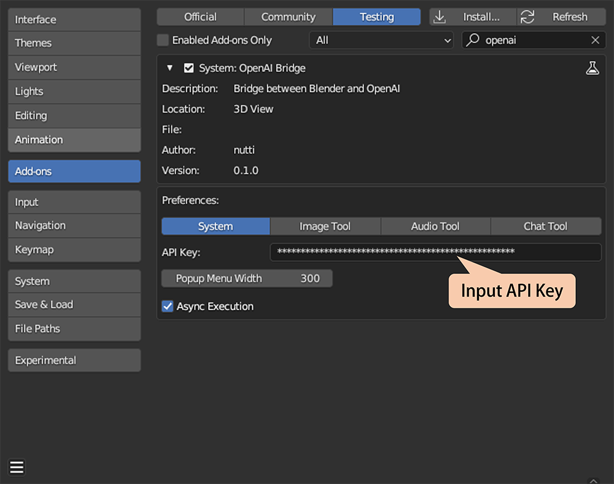
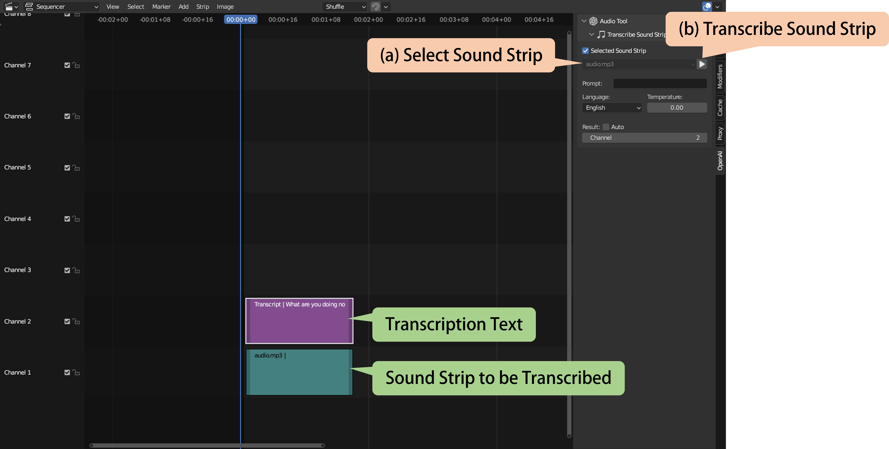
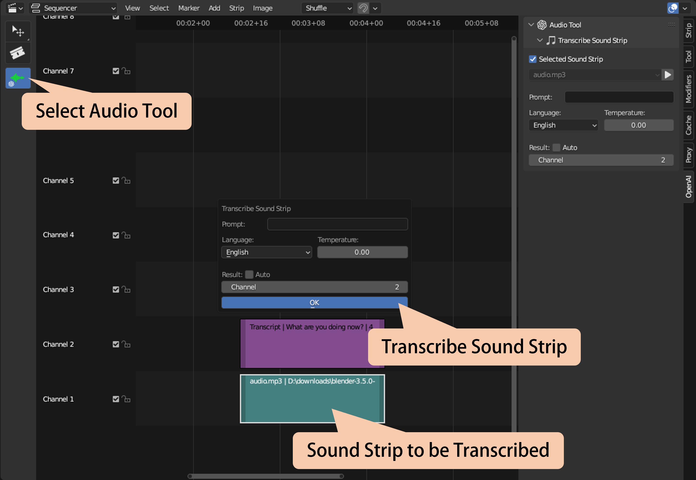
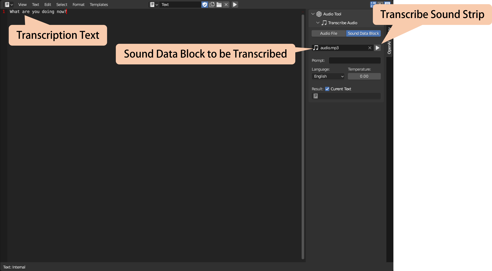
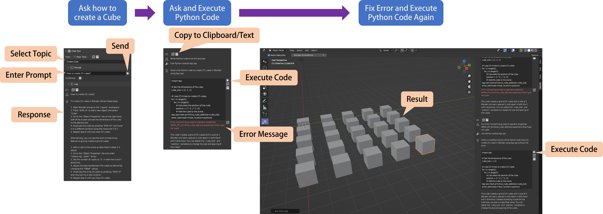
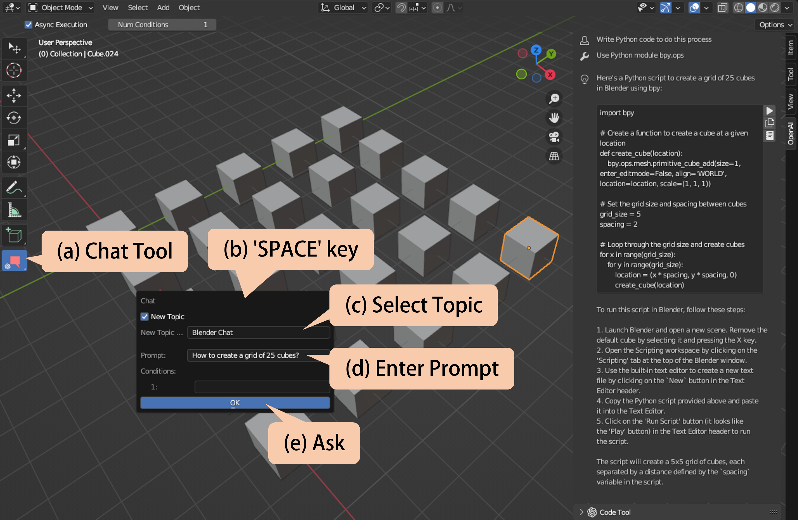

<!-- markdownlint-disable MD024 -->

# Tutorials

* [Preparation](#preparation)
* [Image Tool](#image-tool)
  * [Generate Images](#generate-images)
* [Audio Tool](#audio-tool)
  * [Transcribe Sound Strip](#transcribe-sound-strip)
  * [Transcribe Audio Data](#transcribe-audio-data)
* [Chat Tool](#chat-tool)
  * [Chat](#chat)
  * [Ask Blender Operators/Properties](#ask-blender-operatorsproperties)

## Preparation

This add-on requires an API key to access an OpenAI API.
You need to create an OpenAI account and get an API key from the
[OpenAI Official Site](https://openai.com/blog/openai-api).

Note that you need to pay to use an OpenAI API.
Before using this add-on, check the [Pricing Page](https://openai.com/pricing).

Once you have got an API key, enter the OpenAI API key in the add-on
preferences.

You can change the other properties in the add-on preferences.

## Image Tool

|||
|---|---|
|Editor|Image Editor|
|Supported Models|DALL-E|

Image Tool can generate/edit an image from a prompt.
Image Tool can be accessed from the Sidebar Panel in the [OpenAI] category or
from the tool [OpenAI Image Tool].

### Generate Images

There are 2 ways to generate an image from a prompt.

#### 1. From Sidebar Panel

1. Go to Image Editor.
1. Open [OpenAI] tab on Sidebar.
1. Open a [Generate Image] sub-panel.
1. Change the properties.
1. Enter a prompt.
1. Click the [▶] button.
1. The generated image appears in the [Generated Image] sub-panel.

> Note: The generated image will be saved in `<addon_folder>/_data/image`.

|**Properties**||
|---|---|
|Size|The size of the images to generate.|
|Num|The number of images to generate.|
|Name|Name for a generated image. If [Auto] is checked, it will be configured automatically.|

You can load a generated image into Blender or parmanently remove it from
a file.

#### 2. From Tool

1. Go to Image Editor.
1. Select the tool [OpenAI Image Tool].
1. Press the 'SPACE' key in the Image Editor, and the pop-up dialog appears.
1. Enter a prompt and change the property values.
1. Click the [OK] button.
1. The generated image appears in the [Generated Image] sub-panel.

> Note: The generated image will be saved in `<addon_folder>/_data/image`.

## Audio Tool

Audio Tool can transcribe an audio data.

### Transcribe Sound Strip

|||
|---|---|
|Editor|Sequence Editor|
|Supported Models|whisper-1|

Transcribe Tool can be accessed from the Sidebar Panel in the [OpenAI] category
or from the tool [OpenAI Audio Tool].  
There are 2 ways to transcribe a sound strip.

#### 1. From Sidebar Panel

1. Go to the Sequence Editor.
1. Open [OpenAI] tab on Sidebar.
1. Open a [Transcribe Sound Strip] sub-panel.
1. Change the properties.
1. Select the sound strip to be transcribed. If you check
   [Selected Sound Strip], an active sound strip is transcribed.
1. Click the [▶] button.
1. The text strip with the transcription text is created on the channel.

|**Properties**||
|---|---|
|Prompt|Optional text for a style of transcription text.|
|Language|The language of the input audio.|
|Temperature|A higher value makes the output more random. A lower value makes the output more deterministic.| <!-- markdownlint-disable-line MD013 -->
|Result|The channel the text strip is created. If [Auto] is checked, the channel is selected automatically.| <!-- markdownlint-disable-line MD013 -->

#### 2. From Tool

1. Go to the Sequence Editor.
1. Select the tool [OpenAI Audio Tool].
1. Press the 'SPACE' key in the Sequence Editor, and the pop-up dialog appears.
1. Change the property values.
1. Click the [OK] button.
1. The text strip with the transcription text is created on the channel.

|**Properties**||
|---|---|
|Prompt|Optional text for a style of transcription text.|
|Language|The language of the input audio.|
|Temperature|A higher value makes the output more random. A lower value makes the output more deterministic.| <!-- markdownlint-disable-line MD013 -->
|Result|The channel the text strip is created. If [Auto] is checked, the channel is selected automatically.| <!-- markdownlint-disable-line MD013 -->

### Transcribe Audio Data

|||
|---|---|
|Editor|Text Editor|
|Supported Models|whisper-1|

Audio Tool can transcribe an audio data.  
Transcribe Tool can be accessed from the Sidebar Panel in the [OpenAI] category.

1. Go to the Text Editor.
1. Open [OpenAI] tab on Sidebar.
1. Open a [Transcribe Audio] sub-panel.
1. Change the properties.
1. Select the transcript object from [Audio File] or [Sound Data Block].
1. Select an audio file or an sound data block to be transcribed.
1. Click the [▶] button.
1. The transcription text appears in the Text Editor.

|**Properties**||
|---|---|
|Prompt|Optional text for a style of transcription text.|
|Language|The language of the input audio.|
|Temperature|A higher value makes the output more random. A lower value makes the output more deterministic.| <!-- markdownlint-disable-line MD013 -->
|Result|The text in which the transcription text appears. If [Current Text] is checked, the transcription text appears in the current text.| <!-- markdownlint-disable-line MD013 -->

## Chat Tool

Chat Tool allows you to chat about Blender or ask about operators/properties.

### Chat

|||
|---|---|
|Editor|3D Viewport|
|Supported Models|gpt-3.5-turbo gpt-4 gpt-4-32k| <!-- markdownlint-disable-line MD013 MD033 -->

Chat Tool can be accessed from the Sidebar Panel in the [OpenAI] category or
from the tool [OpenAI Chat Tool].  
There are 2 ways to chat.

#### 1. From Sidebar Panel

1. Go to the 3D Viewport.
1. Open the [OpenAI] tab on sidebar.
1. Select [Topic] (if [New Topic] is not checked) or input a new topic name
   (if [New Topic] is checked). If you choose an existing topic, you can
   continue chatting by using old conversations.
1. Open the [Prompt] sub-panel.
1. Input a prompt and conditions (optional).
1. Click the [▶] button.
1. The response appears in the [Log] sub-panel.

You can copy a chat log to the clipboard or to text.
If the response contains Python code, you can execute it directly.
You can also check the error message if the code fails to execute.

#### 2. From Tool

1. Go to the 3D Viewport.
1. Select the tool [OpenAI Chat Tool].
1. Set [Number of Conditions] in the tool setting if you want to add additional
   conditions.
1. Press the 'SPACE' key in the 3D Viewport, and the pop-up dialog appears.
1. Select [Topic] (if [New Topic] is not checked) or input a new topic name
   (if [New Topic] is checked). If you choose an existing topic, you can
   continue to chat by using old conversations.
1. Enter a prompt and conditions (optional).
1. Click the [OK] button.
1. The response appears in the [Log] sub-panel.

You can copy a chat log to the clipboard or to text.
If the response contains Python code, you can execute it directly.
You can also check the error message if the code fails to execute.

### Ask Blender Operators/Properties

|||
|---|---|
|Editor|All|
|Supported Models|gpt-3.5-turbo gpt-4 gpt-4-32k| <!-- markdownlint-disable-line MD013 MD033 -->

Chat Tool supports asking Blender operators/properties from right-click menu.

1. Move the mouse cursor to menu/panel items.
1. Right-click and the menu appears.
1. When the mouse cursor is over the operator, you can execute
   [Ask Operator Usage]. When the mouse cursor is over the property, you can
   execute [Ask Property Usage].
1. When executed, the new topic is automatically started.
1. The response appears in the [Log] sub-panel.
