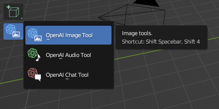
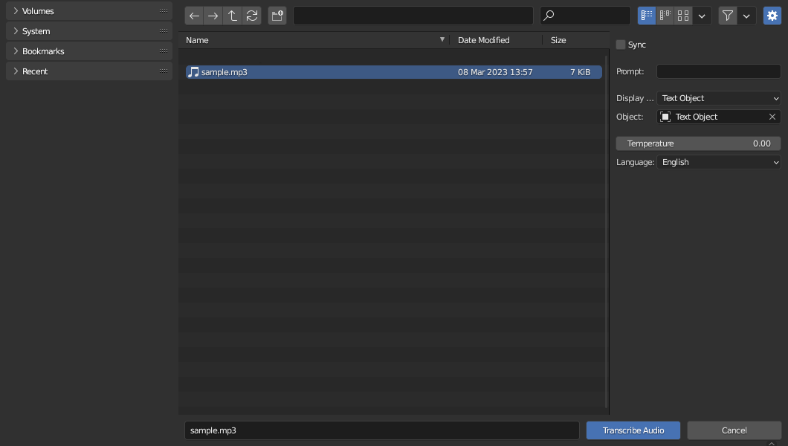
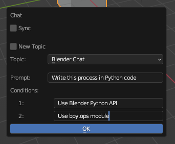
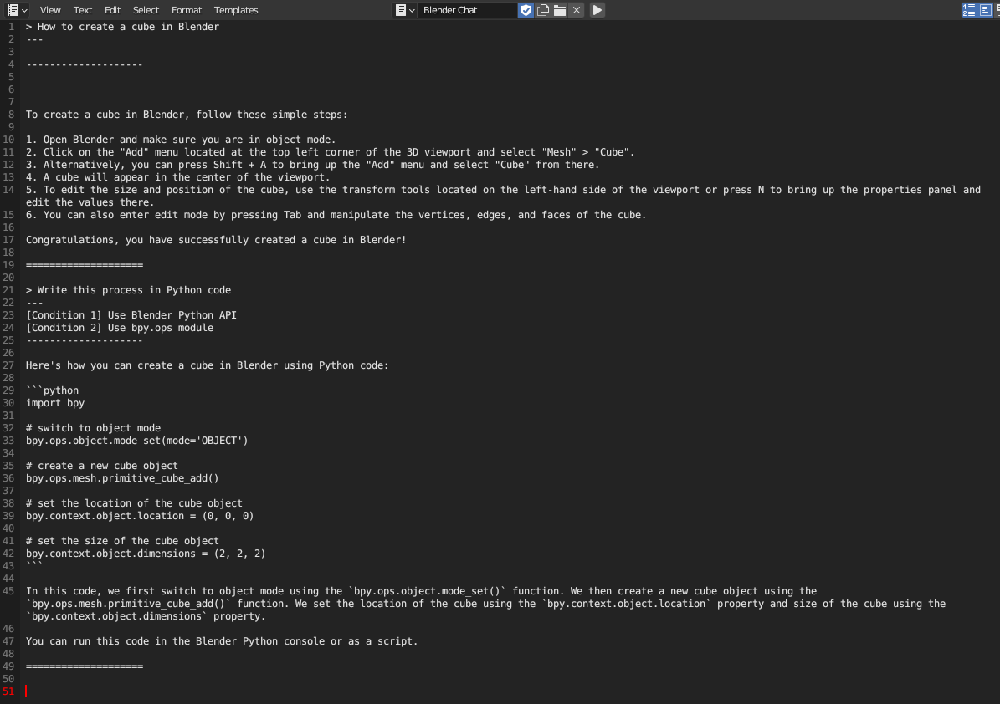

# Tutorials

* [Preparation](#preparation)
* [Image](#image)
  * [Generate Images](#generate-images)
* [Audio](#audio)
  * [Transcribe Audio](#transcribe-audio)
* [Chat](#chat)

## Preparation

To use this add-on, you need to enter the OpenAI API key in the add-on preference.

## Image

### Generate Images

By using the image generation tool, you can generate images using the OpenAI 'DALL-E' API.

#### 1. Select the Image Generation Tool

The image generation tool can be accessed from the Toolbar on 3D Viewport.

#### 2. Set properties

Set properties from the tool configuration.
The configurable properties are as follows.

|**Properties**||
|---|---|
|Sync|Execute an operation synchronously.|
|Number of Images|How many images to generate.|
|Image Size|The size of the images to generate.|

#### 3. Enter a prompt

When you press the 'G' key in the 3D Viewport, the pop-up dialog will be displayed.
Enter a prompt to generate the images and click the OK button to send the request to the OpenAI API.

|**Properties**||
|---|---|
|Image Name|Name of image data block.|
|Remove File|If true, remove generated files after the image block is loaded.|

#### 4. Review the generated images

The generated images will be loaded into Blender automatically.
You can check the generated images in the Image Editor.

If 'Remove File' property is false, you can also check the generated image in the `<addon_folder>/_data/image`.

## Audio

### Transcribe Audio

The audio tool allows you to transcribe the audio file using the OpenAI 'whisper-1' API.

#### 1. Select the Audio Tool

The audio tool can be accessed from the Toolbar on 3D Viewport.

#### 2. Set properties

Set properties from the tool configuration.
The configurable properties are as follows.

|**Properties**||
|---|---|
|Sync|Execute an operation synchronously.|
|Display Target|Target where the text is displayed.|
|Object|The object in which the text is displayed. This property can be configured when 'Display Target' is 'Text Object'.|
|Text|The text in which the text is displayed. This property can be configured when 'Display Target' is 'Text Editor'.|
|Temperature|A higher value makes the output more random. A lower value makes the output more deterministic.|
|Language|The language of the input audio file.|

#### 3. Open an audio file

When you press the 'T' key in the 3D Viewport, the file browser will be displayed.
Select an audio file and click the OK button to send the request to the OpenAI API.

|**Properties**||
|---|---|
|Prompt|The optional text.|

#### 4. Review the result

The transcription can be displayed in the Text Editor or Text Object.

## Chat

The chat tool allows you to chat using the OpenAI 'gpt-3.5-turbo' API.

#### 1. Select the Chat Tool

The chat tool can be accessed from the Toolbar on 3D Viewport.

#### 2. Set properties

Set properties from the tool configuration.
The configurable properties are as follows.

|**Properties**||
|---|---|
|Text Name|Name of the text data block in which the chat log is stored.|

#### 3. Enter a prompt

When you press the 'C' key in the 3D Viewport, the pop-up dialog will be displayed.
Enter a prompt and click the OK button to send the request to the OpenAI API.
You can also change the properties here before sending the request.

#### 4. Review the chat history

The chat history can be displayed in the Text Editor.

